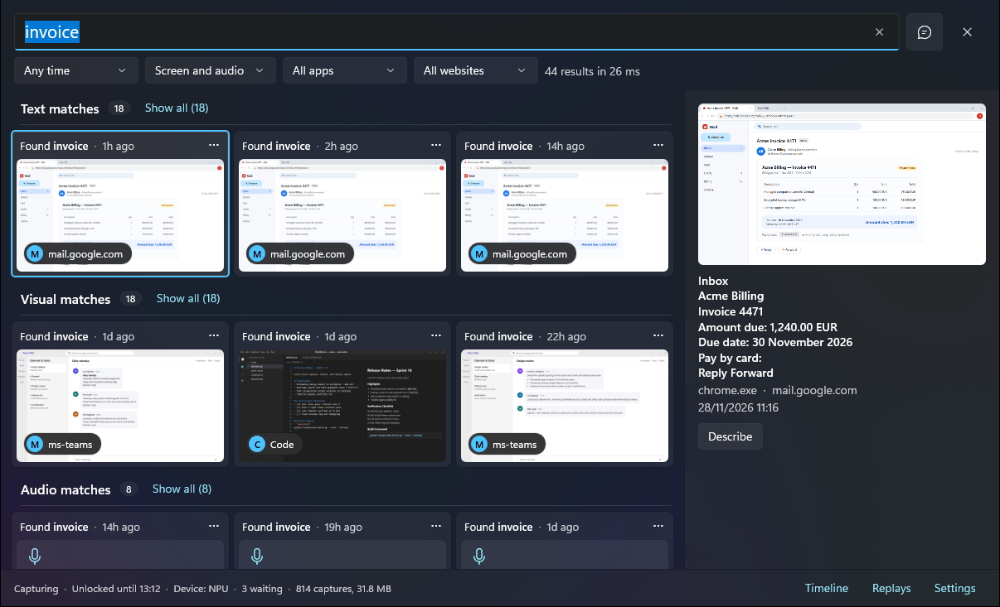

**[AI Content Warning: AI Agents was used to assist with coding]**

<p align="center"></p>

<p align="center">
  <a href="https://github.com/lnminh1411/BetterRecall/releases">Download</a> ·
  <a href="docs/user-guide.md">User guide</a> ·
  <a href="#mcp-use-your-history-from-ai-tools">MCP</a> ·
  <a href="https://github.com/lnminh1411/BetterRecall/issues">Report a problem</a> ·
  BetterRecall contributors
</p>

BetterRecall is a local alternative to Windows Recall, made by BetterRecall contributors. It keeps an encrypted history of your screen, and of speech it hears, and lets you search it in your own words: "the invoice from Acme", "that flight to Tokyo", "what was said in standup". It also keeps an instant replay buffer, so you can save the last minutes of your screen as a video.

<p align="center">
  
  
</p>
<p align="center">
  
  
</p>

Screenshots show the real app running on demo data (`--mock`).

**Status:** early development (0.4.0-dev), Windows 11 x64 only. Linux is planned; macOS is not.

## Privacy

- Everything stays on your PC. Images and text are embedded on your NPU or GPU with EmbeddingGemma 2; nothing is uploaded for search.
- The history is encrypted with a key held by the TPM behind Windows Hello (DPAPI or a passphrase without a TPM).
- It skips private browser windows, apps you exclude and explicit images, and removes card numbers and similar details from stored text.
- BetterRecall makes no network connections while cloud describe is off, which is the default. Turning cloud describe on ends that guarantee: a confirmation says so, and from then on BetterRecall can send a single image you have previewed to the AI provider you configured, only when you click Send. It also enables Ask, a chat that searches your history and answers with sources; each chat shows exactly which captures it would send, with sensitive details redacted, and sends them only after you allow it. Turn it off to restore the guarantee.
- The only other network use is the update check (GitHub Releases) and model downloads (Hugging Face); automatic update checks can be turned off.

## Install

1. Download `BetterRecall-Setup.exe` from [Releases](https://github.com/lnminh1411/BetterRecall/releases).
2. Run it. It installs for your user only (no admin rights) and asks how to get the models: all of them now (about 4 to 6 GB), the minimum set, or later from the Models page. Downloads resume where they stopped.
3. BetterRecall starts after install and on every sign-in (you can turn that off). Open search with `Ctrl+Alt+Space`.

Updates are checked against GitHub Releases and verified with the release signature before they install. Uninstall from Windows Settings > Apps; you choose whether your history is kept.

## First steps

- `Ctrl+Alt+Space` opens search, `Ctrl+Alt+P` pauses capture, `Ctrl+Alt+R` saves the replay, `Ctrl+Alt+Shift+X` is the panic key: it stops capture, clears what is held in memory, locks the history and, if you set panic purge minutes, deletes that many recent minutes. All can be changed on the Shortcuts page.
- The Home page shows what is running and turns features on and off.
- Timeline browses your day; Replays holds saved clips.
- The [user guide](docs/user-guide.md) walks through the rest.

## MCP: use your history from AI tools

BetterRecall includes an MCP server, so AI tools on your PC can search your history when you ask them to. It is off by default; turn it on in Settings > MCP. The tools are read-only (`search_history`, `get_capture`, `recall_status`) and return text, never images. Results go only to the tool that asked.

Set up a client from the command line (an in-app page follows in 0.4):

```powershell
betterrecall mcp clients
betterrecall mcp add cursor
```

`add` writes a `betterrecall` entry into the client's own config file, leaves every other entry alone and keeps a backup next to it. `betterrecall mcp snippet <client>` prints the config to paste by hand instead.

| Client | Setup |
|---|---|
| Claude Desktop, Cursor, Windsurf, VS Code (Copilot), Antigravity, Gemini CLI, Codex CLI, Muse Code | `betterrecall mcp add <client>` |
| Claude Code | `betterrecall mcp snippet claude-code` prints the `claude mcp add` command |
| DeepSeek Harness, Zed, Cline, others | `betterrecall mcp snippet <client>` |

The server command is `%LOCALAPPDATA%\BetterRecall\app\bin\betterrecall-mcp.exe` with no arguments, for any other client.

## System requirements

Estimates for 0.4.0-dev, from the code's defaults and the dev PC's measurements. The first run's benchmark adjusts settings to the machine; the reasons below say what it changes.

**Minimum**

| Part | Requirement | Why |
|---|---|---|
| OS | Windows 11 (build 22000 or later), x64 | The exes target build 20348 or later, which no Windows 10 release reached; system audio uses process loopback, which needs it. Windows on Arm is untested (x64 build only) |
| Runtime | Nothing to install | Release builds ship the Microsoft Visual C++ 2015-2022 runtime DLLs next to the agent and worker (app-local), which the worker's OpenVINO and ONNX Runtime need. If they are missing, the agent says so instead of starting the worker |
| CPU | 4 cores, x64 | With no NPU or usable GPU, embeddings, screen text (OCR) and speech run on the CPU: it works, but indexing lags behind and costs more power (OCR alone is about 1 s of CPU per screen) |
| RAM | 8 GB | Below 8 GB the benchmark cuts the replay to 60 s and, with long retention, the vectors to 512 dimensions. The replay ring stays in RAM (about 90 MB per monitor at the default 120 s and 6 Mbit/s) |
| GPU | DirectX 11 GPU with a WDDM driver | Screen capture uses Desktop Duplication. Replay also needs a hardware video encoder (H.264, HEVC or AV1); with none the benchmark turns replay off |
| Disk | SSD with about 35 GB free | The app takes about 0.6 GB and the models 4 to 6 GB. The history may grow to `storage.maxGb` (20 GB by default), and capture pauses when free space drops under `storage.minFreeGb` (25 GB by default); lower both on a small disk |
| Security | TPM 2.0 recommended | Without a TPM the data key is protected with DPAPI or a passphrase. Without Windows Hello, an unlock password can guard reads |

**Recommended**

| Part | Recommendation | Why |
|---|---|---|
| OS | Windows 11 24H2 or later | The tested path |
| CPU | Intel Core Ultra (Meteor Lake or later) | Its NPU runs embeddings, OCR and the NSFW check through OpenVINO at almost no CPU cost (OCR about 0.1 s of CPU per screen). Keyframe encoding measured 0.45% CPU on average. AMD and NVIDIA systems use the GPU through DirectML instead; other NPUs are not used yet |
| RAM | 16 GB | Full 768-dimension vectors, the 120 s replay and room for the worker's models |
| GPU | GPU with an AV1 encoder (Intel Arc or Xe, NVIDIA RTX 40, AMD RX 7000) | Smallest replay clips, with encoding off the CPU |
| Disk | NVMe SSD with 64 GB or more free | Room for the default 20 GB history cap, the 25 GB free-space reserve, models and replay clips |
| Security | TPM 2.0 plus Windows Hello (face or fingerprint) | Silent key unlock and a quick read gate |

## Build

Requirements on Windows x64:

- .NET 10 SDK (`10.0.403` or later) and Visual Studio Build Tools with the C++ workload and a Windows 10/11 SDK (for Native AOT linking, the MSVC linker and `rc.exe`).
- Rust toolchain via [`rustup`](https://rustup.rs): `stable` toolchain with the `x86_64-pc-windows-msvc` target. The agent (`BetterRecall.Agent.exe`, `rust\crates\br-agent` with `br-core`) and the inference worker (`BetterRecall.Worker.exe`, `rust\crates\br-worker`) are written in Rust and built automatically through `src\BetterRecall.Agent\BetterRecall.Agent.csproj` and `src\BetterRecall.Worker\BetterRecall.Worker.csproj`.

Build the solution with `dotnet build BetterRecall.slnx`, or build a full layout into `artifacts\dev\` with `python Scripts/dev_build.py` (add `--test` to run `cargo test` and the `.NET` test suites first). See `Scripts/models/prepare_all.py` or download the exported models from [Hugging Face](https://huggingface.co/lnminh1411/BetterRecall-models).

## Feedback and support

- Bugs and ideas: [GitHub Issues](https://github.com/lnminh1411/BetterRecall/issues). Please paste logs only after reading them; they never contain captured text, but may contain app names.
- Security problems: report them privately through [GitHub security advisories](https://github.com/lnminh1411/BetterRecall/security/advisories/new), not in public issues.
- If BetterRecall is useful to you, you can [buy me a coffee](https://buymeacoffee.com/TODO). <!-- TODO(links): Buy Me A Coffee page -->

## Links

- Source: [GitHub](https://github.com/lnminh1411/BetterRecall)
- Source: [github.com/lnminh1411/BetterRecall](https://github.com/lnminh1411/BetterRecall)
- Models: [huggingface.co/lnminh1411/BetterRecall-models](https://huggingface.co/lnminh1411/BetterRecall-models)
- Docs: [`docs/`](docs/documentations_summary.md)

## Licence

BetterRecall is published by its contributors under AGPL-3.0-only ([`LICENSING.md`](LICENSING.md)). The models keep their own licences.
